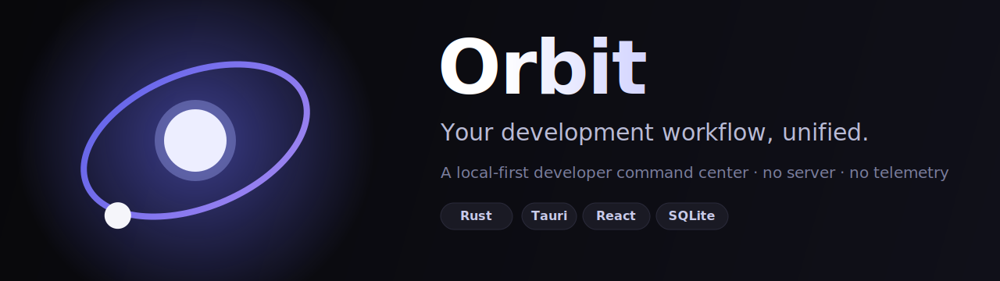

<div align="center">



<br/>

**A local-first, native developer IDE — editor, terminal, source control, and project tooling in one fast desktop app.**

No server. No account. No telemetry. Everything runs on your machine.

[](https://github.com/martin-k-m/orbit/actions/workflows/test.yml)
[](https://github.com/martin-k-m/orbit/actions/workflows/build.yml)
[](https://github.com/martin-k-m/orbit/actions/workflows/release.yml)
[](LICENSE)
[](https://www.rust-lang.org)
[](https://tauri.app)

[Download](#-download) · [Features](#-features) · [Roadmap](ROADMAP.md) · [Architecture](docs/architecture.md) · [Development](docs/development.md) · [Contributing](docs/contributing.md)

[**Website & docs → orbit.blinkdev.me**](https://orbit.blinkdev.me)

</div>

---

## What is Orbit?

Orbit is the desktop centerpiece of your development setup — a native IDE that
scans your code folders, understands your projects, and gives you one fast,
beautiful place to **edit code, run a terminal, drive git, run tests, and manage
containers, databases and APIs** — plus commands, project health, dependencies
and local analytics. All **locally**.

Think of it as the calm control room for everything you build:

- the **project switching** of Arc,
- the **command palette** of Raycast,
- the **polish** of Linear,
- the **process control** of Docker Desktop —

…designed specifically for developers, and never phoning home.

> **Local-first by design.** Orbit has no backend. Your projects, settings and
> analytics live in a single SQLite database on your machine and are never
> uploaded anywhere.

## ✨ Features

| | |
| --- | --- |
| 🗂 **Project management** | Point Orbit at a folder and it detects every Rust, Node/TypeScript, Python, Go and Docker project inside — with the right commands, frameworks and dependencies. |
| ⌘ **Command center** | A `Cmd/Ctrl + K` palette to jump to any project, run `dev`/`build`/`test`, open a terminal or scan a folder — without leaving the keyboard. |
| ▶️ **Run anything** | One click runs a project's dev server, build or tests. Commands are inferred from manifests and can be pinned in a `.project-orbit` profile. |
| 🌿 **Git power center** | A first-class Source Control panel: stage/unstage, inline diffs, commit, history with per-commit patches, branches, fetch/pull/push, stash and tags — on the `git` binary you already have. |
| 🩺 **Project health** | A 0–100 score with concrete warnings — oversized files, stray TODOs, heavy artifacts, missing tests. |
| 📦 **Dependency manager** | The declared dependencies of every ecosystem in a project, read offline from its manifests. |
| 📊 **Developer analytics** | Local, private time tracking: hours per language, projects touched, build times. Never uploaded. |
| 🔐 **Safe by default** | Every command is assessed before it runs — `rm -rf`, `dd`, `mkfs`, `curl \| sh` and force-pushes are refused until you confirm. Secrets in `.env` files are masked. |
| 🗂 **Workspaces & env** | Pin tasks, notes and links per project; see every `.env` in one place with duplicate and missing-variable detection. |
| 🖥 **Native IDE feel** | Tauri 2 app for macOS, Windows and Linux with a tray, native menus, keyboard shortcuts, a status bar, and a flat, dark, professional design. |
| 🖥 **Built-in terminal** | A real PTY-backed shell per project — colours, `top`/`vim`, Ctrl-C and reflow all work. Opens in your shell (`$SHELL`/`COMSPEC`), in the project directory. |
| 📝 **Code editor** | A tabbed CodeMirror editor — multi-file tabs, find/replace, go-to-line, a document outline, font/tab/wrap preferences, plus create/rename/delete in the file tree. |
| 🔎 **Search & quick-open** | Fast find-in-files across a project, and `⌘/Ctrl+K` fuzzy quick-open to jump to any file. |
| 🐳 **Docker · 🗄 Database · 🌐 APIs** | List and control Docker containers/images; browse a SQLite database and run `SELECT`s; send REST requests with a JSON-aware response viewer. |
| 🧪 **Testing & problems** | Run a project's tests with a parsed pass/fail summary (cargo, Jest/Vitest, pytest), and a unified Problems panel with **live language-server diagnostics** (rust-analyzer, tsserver, pylsp, gopls) for your open files. |
| ⌨️ **A real CLI** | The same engine as a terminal companion: `orbit scan`, `orbit info`, `orbit health`, `orbit run`. |

## 📦 Download

**Latest release: [v1.4.3](https://github.com/martin-k-m/orbit/releases/latest)** —
or download directly:

| Platform | Download |
| --- | --- |
| 🍎 **macOS** (Apple Silicon) | [`Orbit_1.4.3_aarch64.dmg`](https://github.com/martin-k-m/orbit/releases/download/v1.4.3/Orbit_1.4.3_aarch64.dmg) |
| 🍎 **macOS** (Intel) | [`Orbit_1.4.3_x64.dmg`](https://github.com/martin-k-m/orbit/releases/download/v1.4.3/Orbit_1.4.3_x64.dmg) |
| 🪟 **Windows** (installer) | [`Orbit_1.4.3_x64_en-US.msi`](https://github.com/martin-k-m/orbit/releases/download/v1.4.3/Orbit_1.4.3_x64_en-US.msi) |
| 🪟 **Windows** (setup) | [`Orbit_1.4.3_x64-setup.exe`](https://github.com/martin-k-m/orbit/releases/download/v1.4.3/Orbit_1.4.3_x64-setup.exe) |
| 🐧 **Linux** (portable) | [`Orbit_1.4.3_amd64.AppImage`](https://github.com/martin-k-m/orbit/releases/download/v1.4.3/Orbit_1.4.3_amd64.AppImage) |
| 🐧 **Linux** (Debian/Ubuntu) | [`Orbit_1.4.3_amd64.deb`](https://github.com/martin-k-m/orbit/releases/download/v1.4.3/Orbit_1.4.3_amd64.deb) |

Verify with [`SHA256SUMS.txt`](https://github.com/martin-k-m/orbit/releases/download/v1.4.3/SHA256SUMS.txt).
Install notes: [docs/installation.md](docs/installation.md) · Build from source:
[docs/development.md](docs/development.md).

## ⌨️ The CLI

The engine ships as a standalone binary too:

```console
$ orbit scan ~/code
✔ 5 projects under ~/code

  Blink                   Rust    ◆ Blink
  Beacon                  TypeScript
  Flux                    Go      ◆ Flux
  Killer                  Rust    ◆ Killer
  Orbit                   Rust

$ orbit info ./blink
Blink
 Rust   ~/code/blink
Developer acceleration toolkit

Git
  branch   main  ✓ clean
  latest   a1b2c3d Added compiler optimization

Health  87/100  Good
  12 files · 3,410 lines · 4 TODOs
  ⚠ src/parser.rs — 900 lines
```

Install it with `cargo install --path crates/orbit-cli` (binary name: `orbit`).

## 🏗 Architecture

Orbit is one Rust engine with three thin surfaces:

```
orbit/
├── apps/
│   └── desktop/         # Tauri 2 app — Rust backend (src-tauri) + React UI (ui)
├── crates/
│   ├── orbit-core/      # the engine: scan · detect · git · health · analytics · SQLite
│   └── orbit-cli/       # terminal companion (binary `orbit`)
├── packages/            # shared, reusable packages
├── scripts/             # release & tooling helpers
└── docs/                # architecture · development · contributing
```

> The marketing site + docs live in a separate repo,
> [`orbit-web`](https://github.com/martin-k-m/orbit-web) → https://orbit.blinkdev.me.

All the interesting logic — what a project is, how healthy it is, which
commands it exposes — lives in **`orbit-core`** and is unit-tested without a UI.
The desktop app and CLI are shells over it, so behaviour is identical
everywhere. Read the full write-up in [docs/architecture.md](docs/architecture.md).

**Tech:** Rust · Tauri 2 · React + TypeScript · Tailwind CSS · SQLite.

## 🚀 Quick start (from source)

```bash
# Engine + CLI (one Cargo workspace)
cargo test
cargo run -p orbit-cli -- scan ~/code

# Desktop app
npm --prefix apps/desktop/ui install
cargo tauri dev --config apps/desktop/src-tauri/tauri.conf.json
```

Full prerequisites and workflows are in [docs/development.md](docs/development.md).

## 🔒 Privacy

Orbit makes **no network requests** on its hot paths. Dependency inspection
reads manifests on disk instead of calling a registry. Analytics are aggregated
locally and never leave your machine. The desktop app ships a restrictive CSP
and a minimal Tauri capability set, and `orbit-core` forbids `unsafe` code.

## 🗺 Roadmap

v1.0 is the foundation. Orbit is growing into a full local developer workspace —
integrated terminal, live logs, a Git power center, Docker, databases, an API
explorer, env management and a plugin SDK.

See **[ROADMAP.md](ROADMAP.md)** for the sequenced plan and honest status of
every feature.

Have an idea? [Open a feature request](https://github.com/martin-k-m/orbit/issues/new/choose)
or start a [discussion](https://github.com/martin-k-m/orbit/discussions).

## 🤝 Contributing

New here (human or AI)? Read **[HANDOFF.md](HANDOFF.md)** first — the honest
ground-truth of what's built, what isn't, and the build/release gotchas.

Contributions are welcome! Start with [docs/contributing.md](docs/contributing.md)
and the good-first-issue label. Before pushing:

```bash
cargo fmt --all
cargo clippy --all-targets -- -D warnings
cargo test
```

## 📄 License

[MIT](LICENSE) © Orbit Contributors.

<div align="center"><sub>Built for developers who want their tools to stay on their machine.</sub></div>
